# project1 or records about monsters
# Table of contents
[UX](#UX)
[Audience](#Audience)
[Purpose](#Purpose)
[Project goals](#Project-goals)
[Viewer goals](#Viewer-goals)
[Strategy Challenge](#Strategy-Challenge)
[Business goals](#Business-goals)
[User needs](#user-needs)
[User Stories](#User-Stories)
# [These are my orignal acceptance criteria and tasks](#These-are-my-orignal-acceptance-criteria-and-tasks)
- [Acceptance criteria](#Acceptance-criteria)
- [Tasks](#Tasks)
# [Later I put some different things on my github project like](#Later-I-put-some-different-things-on-my-github-project-like)
- [Acceptance criteria 2](#Acceptance-criteria-2)
- [Tasks 2](#Tasks-2)
[Scope Challenge](#Scope-Challenge)
# [Product Rollout](#Product-Rollout)
- [Release-1](#Release-1)
- [Release-2](#Release-2)
- [Release-3](#Release-3)
- [Final Total](#Final-Total)
# [Structure Plane](#Structure-Plane)
- [Wireframes made in penpot](#Wireframes-made-in-penpotWireframes-made-in-penpot)
# [External sources](#External-sources)
- [From bootstrap](#From-bootstrap)
- [From Font Awesome](#From-Font-Awesome)
- [From youtube](#From-youtube)
- [From Wallpapers.com](#From-Wallpapers.com)
- [From Pinterest](#From-Pinterest)
- [From AI copilot](#From-AI-copilot)
- [From freeCodeCamp](#From-freeCodeCamp)
- [From things I made up](#From-things-I-made-up)
- [From stack overflow](#From-stack-overflow)
- [From w3schools](#From-w3schools)
- [From geeks for geeks website](#From-geeks-for-geeks-website)
- [From icon-icons](#From-icon-icons)
# [Debugging](#Debugging)
- [problem 1](#problem-1)
- [problem 2](#problem-2)
- [problem 3](#problem-3)
- [problem 4](#problem-4)
- [problem 5](#problem-5)
- [problem 6](#problem-6)
- [problem 7](#problem-7)
- [problem 8](#problem-8)
- [problem 9](#problem-9)
- [problem 10](#problem-10)
- [problem 11](#problem-11)
- [problem 12](#problem-12)
- [problem 13](#problem-13)
- [problem 14](#problem-14)
- [problem 15](#problem-15)
- [html validator](#html-validator)
- [problem 16](#problem-16)
- [problem 17](#problem-17)
- [problem 18](#problem-18)
- [godzilla.html problems](#godzilla.html-problems)
- [problem 19](#problem-19)
- [problem 20](#problem-20)
- [king-ghidorah.html problems](#king-ghidorah.html-problems)
- [problem 21](#problem-21)
- [rodan.html problems](#rodan.html-problems)
- [booking-form.html problems](#booking-form.html-problems)
- [problem 22](#problem-22)
- [success.html problems](#success.html-problems)
- [css validator](#css-validator)
- [Lighthouse](#Lighthouse)
- [Testing the finshed site](#Testing-the-finshed-site)
# [How to make a github repository](#How-to-make-a-github-repository)
# [How do you deploy your site?](#How-do-you-deploy-your-site?)
- [Deployment](#Deployment)
[Bugs](#Bugs)
# UX
# Audience
The main target audience for this website is 12 to 18 year old boys.
People that have started watching media with higher age ratings and grown to
like and tolerate monsters in films. These monsters have an element of horror
, some scenes with death (monsters eating people) and actors acting about trauma.
The main target audience know this type of monster and wants to watch films
about them. The audience is also a fan of youtube raps about monsters and other characters.
# Purpose
The purpose is to talk about the monsters and give a brief explanation about a key part
of a monsters story like the awakening, diamond muscles, golden bones and the molten core.
Also to show musical videos to get across who the monsters are and generate a connection.
However these things all support the main purpose which is to sell monster cinema tickets 
and DVDs. The way the support works is to help make the audience feel the monsters are epic
by showing some cool wallpapers, great music and new stories. The intention was to have a 
relevent advertising panel but time did not permit this.
# Project goals
## Viewer goals
Viewer goals are:
* Interresting monster videos to watch
* Have monster facts about how many 12 year olds tall a monster is
# Strategy Challenge
Opportunity/Problem|Importance|Viability/Feasibility|Total
---|---|---|---
Build a podcast|4|1|5
Build a brand|3|3|6
Search engine optimization|4|3|7
Build a art style|3|2|5
Public voting on how many people agree with something|4|1|5 
# Business goals
Promote your website and brand to sell products and host relevent adverts.
Use meta tag and semantics to help with search engine optimization.
Accessible with alt tags. The value the website owner gains is to 
sell monster related merchandise (t-shirts, pencils, notebook, rubbers, artwork and films) 
call to action (request your order with a order number for each product on an order form)
# User needs
To get the information that they want
For the information to be clear
sign up
informed about new products
useful links 
Who are the users?
Children interested in monster films
What are the Users' needs?
Links to websites about cinemas and age ratings
# User Stories
1. As parent with a child that is interested in monsters I want to know what age ratings
there are on monster films so that I can decide if I want to take my child to see a monster film
2. As a teacher that wants to start a film club I want to know how much a monster film dvd costs
so I can decide what films I might put on in a film club
3. As a child who wants to watch monster films I want to go to a cinema website so
I can reserve my spot at a cinema to watch a film
4. As a monster film maker I want to know about the stats of different monsters so I
can promote my film and write accurate books
# These are my orignal acceptance criteria and tasks
# Acceptance criteria
1. The shop page displays a list of testimonials
2. The shop page displays a star rating
3. The testimonials section is responsive and looks good on multiple devices
# Tasks
1. write a html unordered list for the testimonials
2. Write some font awesome links to use star icons in the review star ratings
3. Use Bootstrap's grid system to make sure the testimonials section is responsive
# Later I put some different things on my github project like
# Acceptance criteria 2
1. User story 4 have a table of facts and fictional monsters
2. User story 3 A booking form for watching films
3. User story 2 The main page features a table with different prices
4. User story 1 The homepage features symbols for age ratings and what they mean
5. User story 1 A list of films that are available with the relevent age ratings
6. User story 1 Each official age rating symbol is matched with a monster at the stage of its life that represents the age of the people who are allowed to see it.
# Tasks 2
1. User story 4 Make a table of information about fictional monsters
2. User story 3 Make a form for booking films to watch
3. User story 3 Make a table using html tags to show different prices
4. User story 1 Integrate some age rating symbols using image tags to the website
5. User story 1 Make an unordered list of films next to symbols for their age rating
6. User story 1 Source some images of different aged monsters to use with image tags
# Scope Challenge
Feature|Difficulty
---|---
main page|1
nav bar|2
iframes|2
background images|1
footer|1
form|3
tables|1
lists|1
## Product Rollout
### Release 1
iframes, background image and main pag. Release 1 total difficulty points 4
### Release 2 
footer and tables lists. Release 2 total difficulty points 3
### Release 3
form, nav bar. Release 3 total difficulty points 5
### Final Total
Product Release total difficulty points 12
# Structure Plane
## Wireframes made in penpot
* Apart from my home page which dosen't use boostrap grids all of my 3 other pages have the same wireframes
because they all have the same structure apart from which background image, text and video they have
they are the same
* Apart from my home page my other pages are responsive when you change the size of the screen the
tables stack on top of eachother using a boostrap grid system
* while using penpot I had the issue of exporting the wireframes I had made which didn't work very well
because I only seemed to be able to download one file even though there were 5 so I had to move each one to the top
of the list before exporting it. Later markdown was unable to show any of my PDFs so I used snipping tool to get the wireframe
images that I actually used in my readme file which the links to are below 
* 
* 
* 
* 
* 
### notes maybe add buttons that match the color scheme of a page when you hover over them and when you don't
# External sources
# From bootstrap
* [Bootstrap screen sizes for grid options used on the monster stats tables for different screen sizes](https://getbootstrap.com/docs/5.3/layout/breakpoints/)
* [Bootstrap buttons used to be used on a book now button on the index.html page until it was replaced with a navbar option](https://getbootstrap.com/docs/5.3/components/buttons/)
* [Bootstrap navbar used on all the pages as the navbar at the top](https://getbootstrap.com/docs/5.3/components/navbar/#how-it-works)
# From Font Awesome
* [instagram icon from Font Awesome on the footer](https://fontawesome.com/icons/instagram?f=brands&s=solid)
* [facebook icon from Font Awesome on the footer](https://fontawesome.com/icons/facebook?f=brands&s=solid)
* [x icon from Font Awesome on the footer](https://fontawesome.com/icons/square-twitter?f=brands&s=solid)
# From youtube
* [NerdOut! musical video from youtube on Godzilla used as a trailer on the godzilla.html page](https://www.youtube.com/watch?v=okMyRuVLVl0)
* [Aaron Fraser-Nash musical video from youtube on King Ghidorah used as a trailer on the king-ghidorah.html page](https://www.youtube.com/watch?v=S_mnlCuDljI)
* [Aaron Fraser-Nash musical video from youtube on Rodan used as a trailer on the rodan.html page](https://www.youtube.com/watch?v=mkoaxHTHzgg)
# From Wallpapers.com
* [Godzilla ocean image used on booking-form.html as a background image](https://wallpapers.com/wallpapers/godzilla-4k-ocean-j4mrrzqjy9vdfhxf.html)
* [Godzilla city image used on godzilla.html as a background image as a background image](https://wallpapers.com/wallpapers/godzilla-dominance-over-cityscape-igsni1rq48nf7yjv.html)
* [4 Titans image used on index.html as a background image](https://wallpapers.com/wallpapers/rodan-znintsr46vlv41u1.html)
* [Rodan image used on rodan.html as a background image](https://wallpapers.com/wallpapers/rodan-1280-x-882-mkjzoe6324kfao20.html)
* [king ghidorah image used on king-ghidorah.html as a background image](https://wallpapers.com/wallpapers/king-ghidorah-1500-x-904-wallpaper-3jelas62x68nb63n.html)
# From Pinterest
*[image of baby mothra and godzilla for age ratings repurposed for form filled out successfully page called success.html](https://uk.pinterest.com/pin/818107088541699015/)
# From AI copilot
* [link to AI chatbot that I used for finding the hex code for the dark navbar theme so I could color match it with the footer](https://copilot.microsoft.com/)
* [link for AI chatbot for explaining how to do a transparent black background which was used on the form on booking-form.html and for the paragraphs on all the pages like the bit about what is the awakening on index.html but also the paragraphs under
Diamond Muscles, Golden Bones and Molten Cores on the other pages](https://www.bing.com/copilotsearch?q=how+do+you+set+a+id+in+css+to+transparent+black&form=CSBRAND)
*[link to AI chatbot for explaining how to change in the letters in a tag to uppercase](https://www.bing.com/copilotsearch?q=how+do+you+set+all+the+letter+in+a+tag+to+uppercase+css&form=CSBRAND)
# From freeCodeCamp
* [removing underline from link guide](https://www.freecodecamp.org/news/remove-underline-from-link-in-css/)
# From things I made up
* All the monster stats like Godzilla's stats are made up by me
* Times Films and prices are all made up by me
* The Awakening and the Vita are made up by me so are Diamond Muscles, Golden Bones and Molten Cores
# From stack overflow
*[how to center a iframe used on the videos on the index.html, godzilla.html, king-ghidorah.html and rodan.html pages](https://stackoverflow.com/questions/8366957/how-to-center-an-iframe-horizontally)
# From w3schools
* [centering a table example from w3schools used on the on the index.html, godzilla.html, king-ghidorah.html and rodan.html pages](https://www.w3schools.com/howto/howto_css_table_center.asp)
# From geeks for geeks website
* [how to have a button with a link wihtout having the button as a child of the a tag was used on a book now button that was later replaced](https://www.geeksforgeeks.org/html/how-to-create-an-html-button-that-acts-like-a-link/)
# From icon-icons
* [link to icon site which is where the image for the fav icon was found](https://icon-icons.com/search/icons/letter-a)
# Debugging
# problem 1
The navbar button wasn't working and when you click on it nothing happens the issue was I was missing a 
link from bootstrap that goes at the end of your code just before the closing body tag.
---

---
# problem 2
The issue here was the navbar appears on the side of the screen instead of the top to fix this I added the fixed-top class to the
nav tag
---

---
# problem 3
Here you can see the newer version with the navbar at the top
---

---
# problem 4
Orignally the red background was on top of the footer so it looked like part of the footer was missing
if I remember correctly I fixed this problem by adding the fixed-bottom class to the footer
---

---
# problem 5
This is a failed attempt to fix the same problem
---

---
# problem 6
This is a image of a fixed url that had ../assets at the start instead of ../images
---
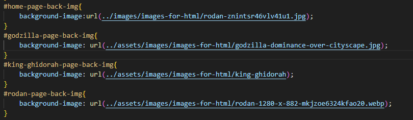
---
# problem 7
For a while when I was trying to use an iframe to embed a youtube video I got an error 153
however when you look at the page from github as a deployed site the video/iframe works
---

---
# problem 8
Orginally when the header position was fixed it moved down with the navbar which I thought looked wrong
I also tried a postion relative but that brought back the problem with the footer so in the end I used
a position absolute which works
---
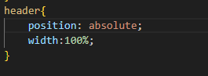
---
# problem 9
When I first made the table for age and height the columns were too close together so I
tested a style with extra width. In the end I made a class called table-1 and set the width
to 150 solving the isssue so that there is enough distence between the columns so that you can read the text
---
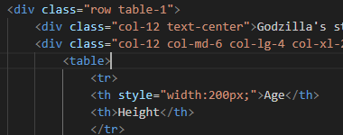
---
# problem 10
This is what the table looked like after it had been styled
---
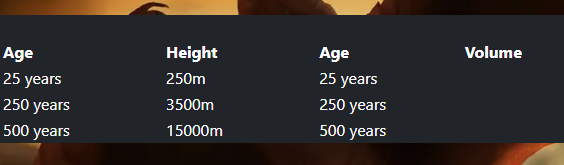
---
# problem 11
When I first did this class I forgot a few selectors like div tr
---
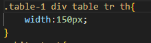
---
# problem 12
First I tired to import a button from boostrap
---
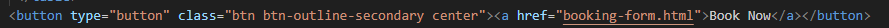
---
# problem 13
I needed a link from the book now button to the booking-form page but the <a> (anchor tag) link made the text
on the button blue and highlighted
---

---
# problem 14
I tried making my own button but it took up the whole screen so I scraped it
---
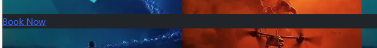
---
# problem 15
I changed my button so that the button tag was inside an <a> (anchor tag) tag instead of it being the other way around.
This solved the issue of the whole button going white when you hovered over the very edge (when you hover over the
text the text goes black so you can still see it) this might be because I had some styles for the <a> (anchor tag) and button tag 
that were pretty much the same and the bootstrap was overwriting the button tag class but not the <a> (anchor tag) tag so things only 
changed while you hover over the <a> (anchor tag) tag which just has text.

---
# html validator
These are the issues I got when I put my index.html page into html validator.
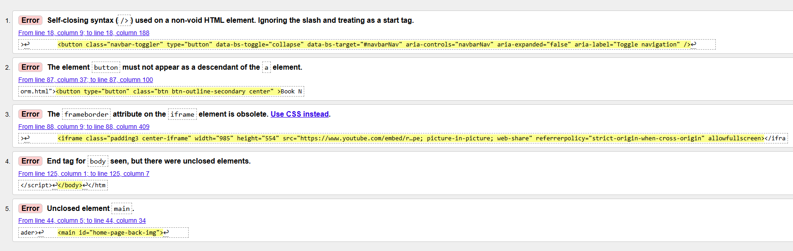
---
# problem 16
Here we have a tag I deleted like the validator suggested.
---
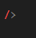
---
# problem 17
According to the html validator I should not have this frameborder attribute so I got rid of it.
---
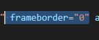
---
# problem 18
I was missing a main closing tag so I added one in and it looks like this and after I put my page back into the validator it said
there were no errors. This is the html validator passing with no errors.
---

---
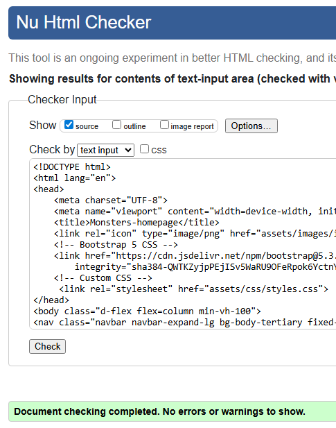
---
# godzilla.html problems
These are the issues I got when I put my godzilla.html page into html validator.
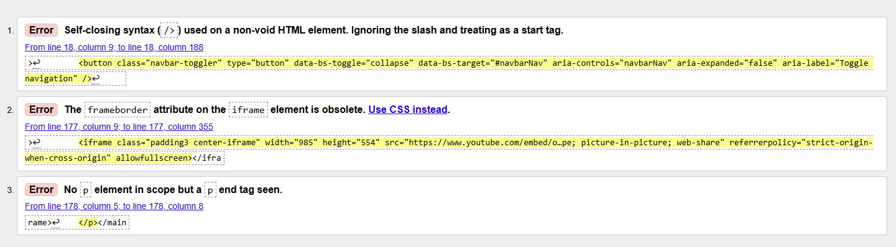
---
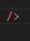
---
# problem 19
Here there was a / for no apparent readon so I got rid of it.
---
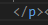
---
# problem 20
Here the validator picked up that there was a p tag that was closed but never opened so I removed it
There was also a frameborder that got removed just like with the index.html page. After putting
the page back into the validator there were no more errors. This is the html validator passing with no errors.
---
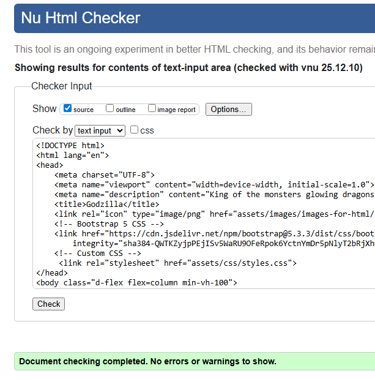
---
# king-ghidorah.html problems
These are the issues I got when I put my king-ghidorah.html page into html validator
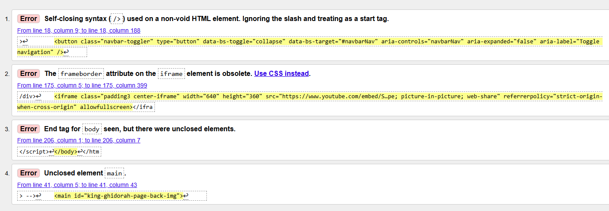
---
# problem 21
There was also a frameborder that got removed just like with the index.html page and also similarly a / that I removed I also added a closing main tag. None of which I have images for king-ghidorah because I already have a image of all those issues for other pages. After putting the page back into the validator there were no more errors. This is the html validator passing with no errors.
---
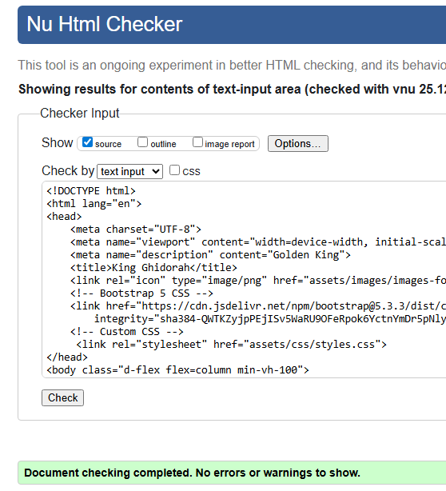
---
# rodan.html problems
These are the issues I got when I put my rodan.html page into html validator
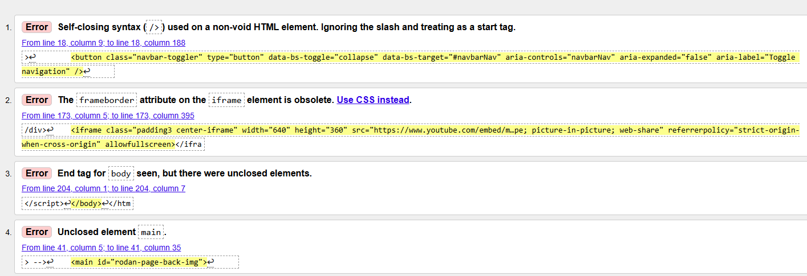
---
All the issues with the rodan page were the same as the king-ghidorah page and now the validator says there are no errors.This is the html validator passing with no errors.
---
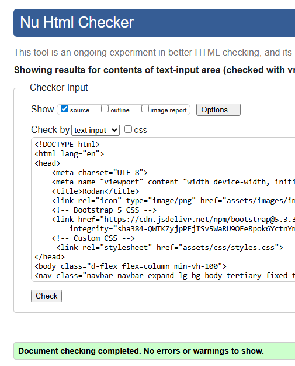
---
# booking-form.html problems
These are the issues I got when I put my booking-form.html page into html validator
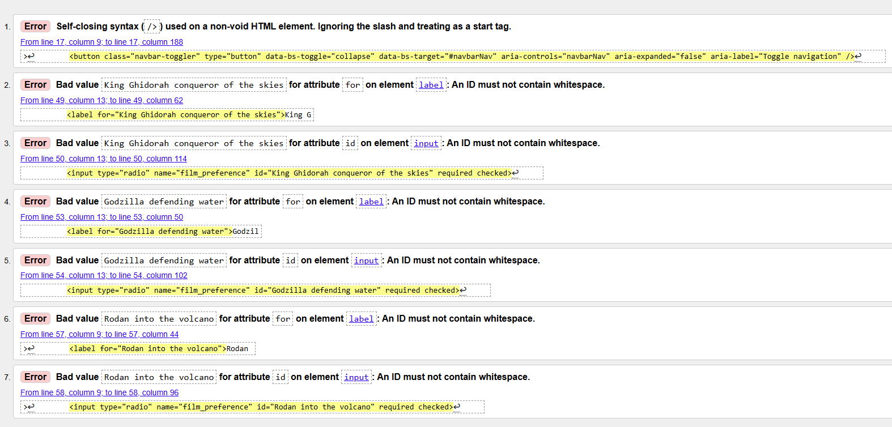
---
# problem 22
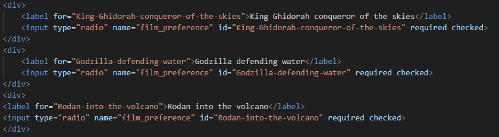
Here there was the issue with the accidental / which has now been removed. The other six issues are pretty much the same issue where I incorrectly used white space on a label id but 3 times for input tags and 3 times for label tags. This is the html validator passing with no errors.
---
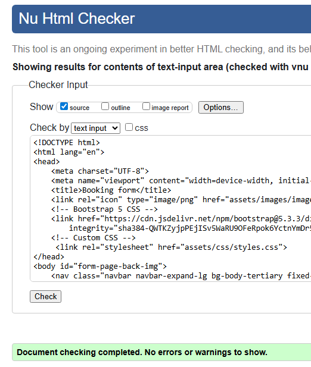
---
# success.html problems
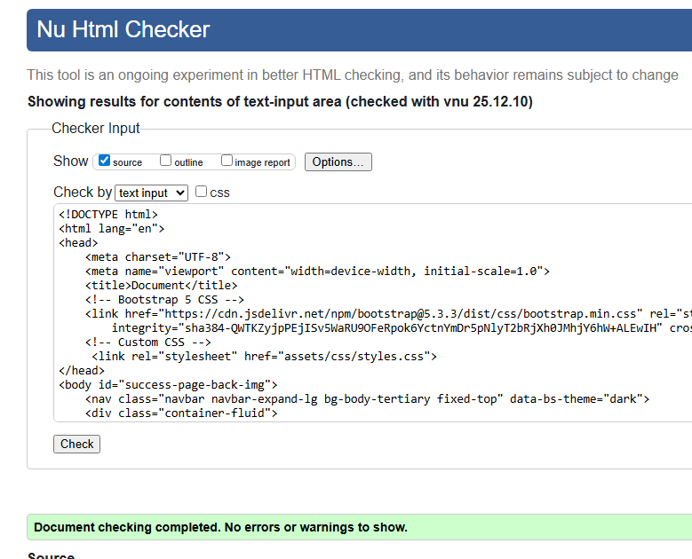
My success page had no errors when I put through the html validator. This is the html validator passing with no errors.
---

# css validator
The first time I put my css into the validator it said there were no errors so I don't have any issue fixing for it.
---
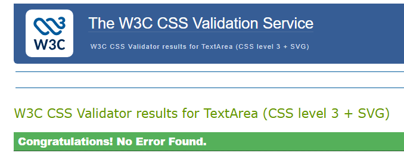
---
# Lighthouse
* 
* Lighthouse was used to generate a report but I didn't have enough time to go through it
# Testing the finshed site
# Test Table
| Description | Outcome | passed
---|---|---
Is the navbar and footer always visable and responsive?|The Navbar and footer stick to the top and bottom|Passed
Is the content still functional and visable despite the footer and Navbar?|There is visable content|Passed
The videos are functional and you can watch them?|The videos are playable|passed
Is the text functional or visible?|Text is white|passed
Do the tables on all the pages stack so you can still view them on different screen sizes? Are they responsive?|The tables use bootstrap to stack on different screen sizes|passed
Are the background images behind the content?|You can see the background images but you can still see the main content infront|passed
Does the booking form page have all input fields required?|The form has to be fully filled in to do anything|passed
Does the form take you a success page after you fill it out properly so you know that you did it right?|You get taken to a success page|passed
Can the site take you to a custom error page?|There is a custom error 404.html page|passed
# Tests laid out with images and bullet points
* Test 1 is the navbar and footer sticking to the top and bottom when you move the screen which works
* Test 2 the content is positioned so the footer and navbar don't stop you seeing it which it does
* Test 3 you can play the videos on the godzilla, index/home, rodan and king ghidorah pages which works
* Test 4 the text is visible and the text stands out as white on mostly dark backgrounds

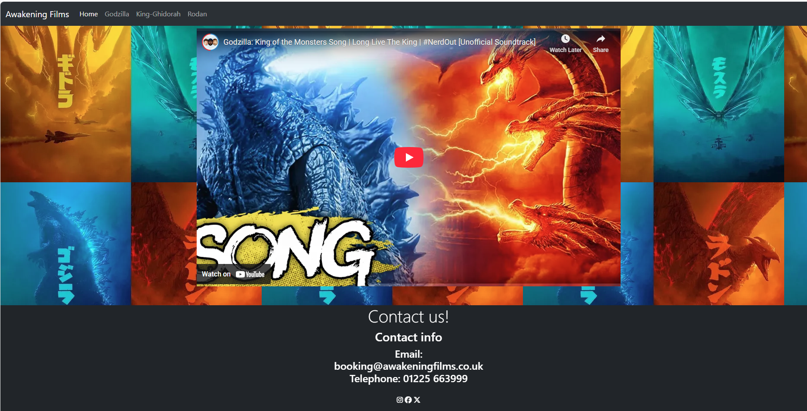

---
* Test 5 the tables on the godzilla, king ghidorah and rodan pages are reponsive so they stack when the screen is too small to see them all at once. Here we have images of the tables each at 1/6, 1/3, 1/2 and 1/1 of the full screen for sizes xl lg md and default
which could represent viewing on desktop tablet and mobile which has seemed to work in the images below
---
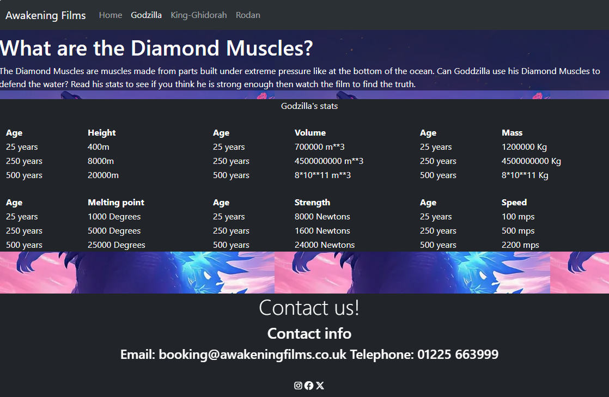
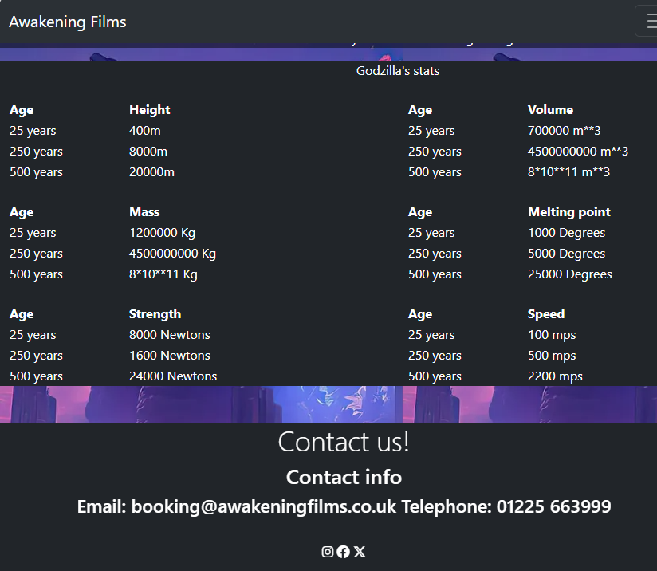
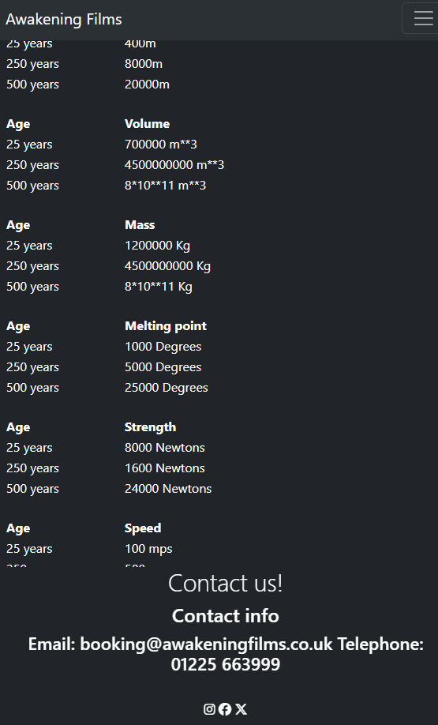
* Test 6 the background images fill the avaliable space and are behind the main content which I think is true 
for all the pages

* Test 7 the form has all fields required before any information can be submited which is true

* Test 8 once the form is correctly submited the user is taken to a success page to show everything has worked 
which it does

* Test 9 the site has a custom 404 error pag which you can see in the image below

# How do you deploy your site?
A guide to publishing a site on github was found at 
[Link to guide on publishing](https://www.educative.io/answers/how-to-make-your-site-live-on-github-pages)
To add a new file you use the git commands 
git add new_file_name 
git commit -m "comments about the new file"
git push
To update changes to a existing file use
git commit -m "comments about the changes" 
and git push
This works for a single developer.
If other developers have cloned and changed the site
then you should do a git pull command to download the 
other developers changes. This was discovered when I 
updated my readme on the github site and I had to pull
the latest readme file back onto my computer before github
would let me push any changes.
Some information and advice on this was obtained
from stackoverflow.com via google
# How to make a github repository
first you click on new or the plus icon in the top-right for a new repository
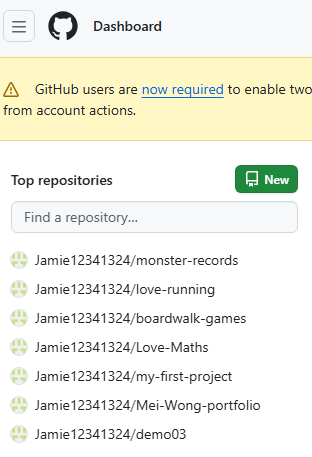
Then you need to name your new repository
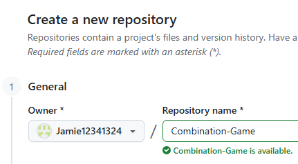
Then go to terminal in visual studio code which is at the top-left and go new terminal.
Then type out the new commands in the terminal in the image below to link you visual studio code folder to
the github repository.
These are the commands
…or create a new repository on the command line
echo "# deploy-test" >> README.md
git init
git add README.md
git commit -m "first commit"
git branch -M main
git remote add origin https://github.com/Jamie12341324/deploy-test.git
git push -u origin main
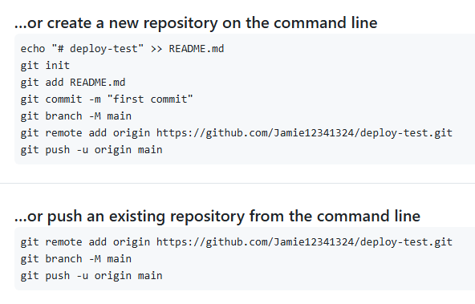
The images from github repository and deployment were made by using snipping tool on [github.com](https://github.com/Jamie12341324/deploy-test)
# Deployment
The first time I had to delpoy my site I 
went to settings in github and selected pages.
Then I selected the main branch to deploy from 
and clicked save. Then I waited for my url to appear.
Some help was obtained from the guide mentioned above.
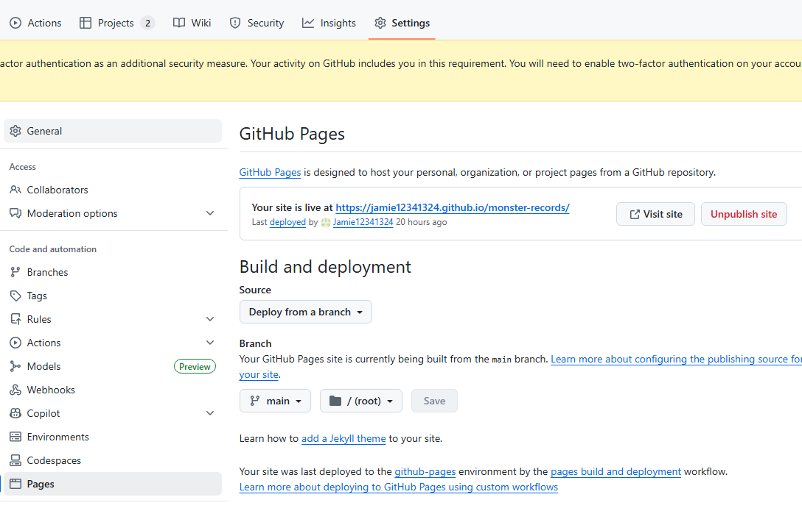
# Bugs
The booking form dosen't display on a phone properly and that would be the next thing to fix 
